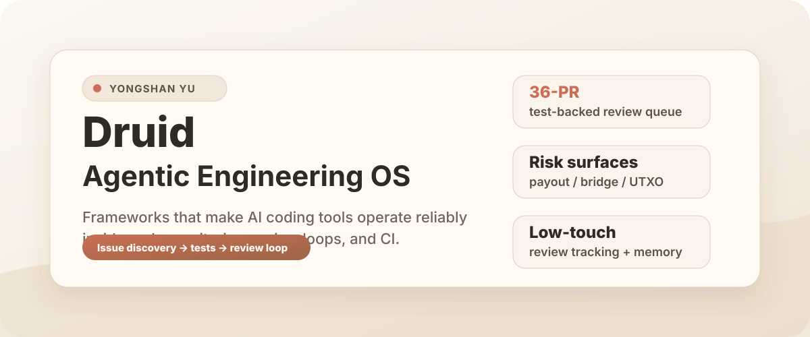
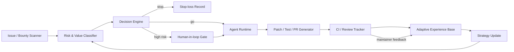

  

<h1 align="center">Yongshan Yu</h1>

  <strong>Agent framework builder / AI-assisted engineering workflow architect / security automation systems builder</strong>

  I build frameworks that make AI coding tools operate reliably inside real repositories.

  <a href="https://github.com/yyswhsccc">GitHub</a>
  ·
  <a href="https://github.com/yyswhsccc/druid-agentic-engineering-os">Druid flagship</a>
  ·
  <a href="https://yyswhsccc.github.io/druid-agentic-engineering-os/">Portfolio</a>
  ·
  <a href="https://www.linkedin.com/in/yongshan-yu-195771319/">LinkedIn</a>

## Command Signal

| Signal | Public evidence | Why it matters |
|---|---|---|
| **Agent framework builder** | Druid: issue/risk scanner -> patch/test generator -> CI/review tracker -> adaptive memory. | Companies should hire me to build internal engineering agents, not to manually operate one bot. |
| **36-PR RustChain review queue** | Open review queue across payout, bridge, UTXO, governance, bounty, security, and reliability surfaces. | Demonstrates systematic risk-surface discovery, small reviewable PRs, tests, and ongoing review-loop tracking. |
| **Vulnerability-shaped risk discovery** | Auth/admin boundaries, public data exposure, XSS/CORS, exact-once payout semantics, bridge races, transaction atomicity. | Turns security/reliability/accounting risks into bounded patches with regression coverage. |
| **Low-touch after setup** | Discovery, risk gates, PR maintenance, CI/review tracking, learning, and stop-loss live in the framework. | Reduces recurring engineering coordination cost while keeping humans in the loop for high-risk decisions. |

## What I Build

| Capability | System behavior |
|---|---|
| **Agentic engineering operating systems** | Connect repo state, issue sources, tests, review rules, CI, risk policies, and strategy memory. |
| **AI security automation** | Scan for vulnerability-shaped engineering risks and produce scoped, test-backed fixes. |
| **Developer productivity systems** | Convert repeated engineering coordination into auditable agent loops. |
| **Open-source PR operations** | Track review, merge, close, bounty, and maintainer feedback as learning signals. |

## Featured System: Druid

**Druid is proof that I can design low-touch agentic engineering frameworks.**

It is not a single-purpose PR bot. It is an operating loop for finding, validating, fixing, testing, submitting, maintaining, and learning from engineering work.

Project entry: [Druid flagship repo](https://github.com/yyswhsccc/druid-agentic-engineering-os) / [GitHub Pages portfolio](https://yyswhsccc.github.io/druid-agentic-engineering-os/).

The strongest signal is not that Druid found bugs. The strongest signal is that I built the architecture that lets Druid keep finding, validating, maintaining, and learning from engineering work with low ongoing supervision.

## Evidence Dashboard

Last audited: **2026-06-11**.

**Druid generated a 36-PR test-backed review queue across core RustChain risk surfaces.**

Open PRs below are **review queue evidence**, not merged/accepted claims.

| Risk surface | High-signal PRs | Proof value |
|---|---|---|
| Payout exact-once / terminal status | [#7385](https://github.com/Scottcjn/Rustchain/pull/7385), [#7357](https://github.com/Scottcjn/Rustchain/pull/7357), [#7353](https://github.com/Scottcjn/Rustchain/pull/7353) | Missing-row handling, terminal-status protection, and repeated-claim prevention in money paths. |
| Bridge terminal integrity | [#7363](https://github.com/Scottcjn/Rustchain/pull/7363), [#7343](https://github.com/Scottcjn/Rustchain/pull/7343), [#7330](https://github.com/Scottcjn/Rustchain/pull/7330), [#7316](https://github.com/Scottcjn/Rustchain/pull/7316) | Bridge state visibility, terminal race protection, malformed config handling, and operator-only flow clarity. |
| UTXO / transaction atomicity | [#7350](https://github.com/Scottcjn/Rustchain/pull/7350), [#7339](https://github.com/Scottcjn/Rustchain/pull/7339), [#7335](https://github.com/Scottcjn/Rustchain/pull/7335), [#7333](https://github.com/Scottcjn/Rustchain/pull/7333) | Nonce serialization, ownership invariants, conservation checks, and rollback edges. |
| Governance accounting | [#7347](https://github.com/Scottcjn/Rustchain/pull/7347), [#7345](https://github.com/Scottcjn/Rustchain/pull/7345) | Pagination and proposal-fee accounting paths that could otherwise drift silently. |
| Bounty attribution / claims | [#7367](https://github.com/Scottcjn/Rustchain/pull/7367), [#7361](https://github.com/Scottcjn/Rustchain/pull/7361), [#7359](https://github.com/Scottcjn/Rustchain/pull/7359), [#7383](https://github.com/Scottcjn/Rustchain/pull/7383) | Claim completion, persistence, missing status rows, and honest reward/receipt messaging. |
| Browser/security boundaries | [#7382](https://github.com/Scottcjn/Rustchain/pull/7382), [#7379](https://github.com/Scottcjn/Rustchain/pull/7379), [#7377](https://github.com/Scottcjn/Rustchain/pull/7377), [#7341](https://github.com/Scottcjn/Rustchain/pull/7341) | Legacy admin gates, dashboard escaping, Socket.IO CORS, and public lock-status redaction. |
| Operational reliability | [#7380](https://github.com/Scottcjn/Rustchain/pull/7380), [#7376](https://github.com/Scottcjn/Rustchain/pull/7376), [#7328](https://github.com/Scottcjn/Rustchain/pull/7328), [#7326](https://github.com/Scottcjn/Rustchain/pull/7326), [#7322](https://github.com/Scottcjn/Rustchain/pull/7322) | Malformed numeric env defaults, limit floors, payload compatibility, and service hardening. |

Queue state at audit time: **36 open RustChain PRs**, including **34 clean** and **2 older low-touch maintenance PRs**.

## Public Proof

### Merged work

| PR | Proof value |
|---|---|
| [RustChain #6219](https://github.com/Scottcjn/Rustchain/pull/6219) | Signed-transfer nonce ordering with replay-focused tests; proves money-path correctness work. |
| [RustChain #6673](https://github.com/Scottcjn/Rustchain/pull/6673) | Deterministic pending transaction ordering; proves queue/state reasoning. |
| [RustChain #6188](https://github.com/Scottcjn/Rustchain/pull/6188) | Block-save atomicity around template production; proves concurrency and state integrity judgment. |
| [RustChain #6666](https://github.com/Scottcjn/Rustchain/pull/6666) | Data custody proof checks; proves protocol-surface implementation ability. |
| [RustChain #6667](https://github.com/Scottcjn/Rustchain/pull/6667) / [#6674](https://github.com/Scottcjn/Rustchain/pull/6674) | Slasher evidence and slashing penalty core; proves validator/security economics surface work. |
| [RustChain #6838](https://github.com/Scottcjn/Rustchain/pull/6838) | Core RPC API rate limiting; proves public API hardening. |
| [RustChain #6825](https://github.com/Scottcjn/Rustchain/pull/6825) | Event faucet claim codes; proves reward/claim workflow implementation. |

### Open high-signal review queue

| PR | Proof value |
|---|---|
| [#7382](https://github.com/Scottcjn/Rustchain/pull/7382) | Legacy protocol escrow admin-gate parity; security boundary discovery and patching. |
| [#7379](https://github.com/Scottcjn/Rustchain/pull/7379) | Dashboard field escaping; browser-facing injection risk control. |
| [#7350](https://github.com/Scottcjn/Rustchain/pull/7350) | Pending nonce admission serialization; transaction race and exact-once semantics. |
| [#7343](https://github.com/Scottcjn/Rustchain/pull/7343) | Bridge terminal race protection; state-machine integrity. |
| [#7335](https://github.com/Scottcjn/Rustchain/pull/7335) | Mempool conservation against unspent inputs; UTXO accounting invariant. |

### Credited / synthesized work

| PR | Final path | Why it matters |
|---|---|---|
| [#6757](https://github.com/Scottcjn/Rustchain/pull/6757) | Synthesized into merged [#6769](https://github.com/Scottcjn/Rustchain/pull/6769). | Settlement guard and tests were publicly co-credited with RTC reward signals. |
| [#6842](https://github.com/Scottcjn/Rustchain/pull/6842) | Superseded by [#6900](https://github.com/Scottcjn/Rustchain/pull/6900). | Owner credited the bounded pending-confirm design. |

### Outside RustChain

| PR | Proof value |
|---|---|
| [mgzwarrior/mgz-pkmn #217](https://github.com/mgzwarrior/mgz-pkmn/pull/217) | Maintainer-approved CLI helper tests; proves framework transfer beyond RustChain. |

## Capability Map

| Company need | What I can build |
|---|---|
| Internal engineering agents | Low-touch systems connected to repos, issues, CI, ownership, docs, and review policy. |
| Security/risk discovery | Agents that scan for auth gaps, public exposure, race conditions, exact-once failures, and state-machine bugs. |
| Developer productivity | Agents that turn repeated maintenance and review coordination into auditable loops. |
| PR operations | Systems that generate small patches, tests, PR bodies, maintenance notes, and stop-loss records. |
| Adaptive memory | Feedback loops that learn from merged, closed, dirty, superseded, rewarded, and stale work. |

## What I Can Build For Teams

- A Druid-like internal agent framework for your codebase.
- Security and reliability risk-surface scanners that produce bounded fixes.
- Review-loop automation that tracks CI, ownership, maintainer feedback, and stale work.
- Evidence dashboards for engineering leadership.
- Low-touch engineering agents with human-in-loop gates for high-risk decisions, policy changes, and final approvals.

<strong>Profile system notes</strong>

- This profile intentionally uses self-hosted SVG assets instead of third-party badge walls, visitor counters, or fragile animation widgets.
- Optional dynamic metrics can be added later, but should have self-hosted fallbacks so the profile still looks good if a third-party service fails.
- Open PR counts must be re-audited before public launches or LinkedIn posts.
- Pinning, GitHub Pages bridge, and social-preview notes: [`docs/profile-command-center.md`](./docs/profile-command-center.md).

## Current Focus

`agent framework design` · `AI-assisted engineering workflow architecture` · `security automation` · `developer productivity systems` · `open-source PR operations` · `low-touch internal engineering agents`

## Contact

| Channel | Link |
|---|---|
| GitHub | [yyswhsccc](https://github.com/yyswhsccc) |
| LinkedIn | [Yongshan Yu](https://www.linkedin.com/in/yongshan-yu-195771319/) |
| Email | [yuyongshan573@gmail.com](mailto:yuyongshan573@gmail.com) |
