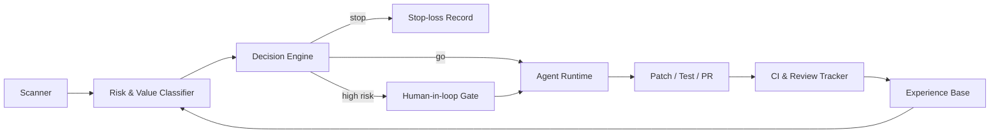

<h1 align="center">Yongshan Yu</h1>

  I build autonomous agents that do real engineering work in the wild —
  and I'm heading toward <strong>reinforcement learning research</strong> to understand why they work and how they fail.

  <a href="https://github.com/yyswhsccc/druid-agentic-engineering-os">Druid (flagship)</a> ·
  <a href="https://yyswhsccc.github.io/druid-agentic-engineering-os/">Portfolio</a> ·
  <a href="https://www.linkedin.com/in/yongshan-yu-195771319/">LinkedIn</a> ·
  <a href="mailto:yuyongshan573@gmail.com">Email</a>

---

## 🤖 Druid — an agent that ships

Druid is an autonomous engineering loop I designed and built: it scans a live codebase
for vulnerability-shaped risks, decides what's worth fixing, writes the patch and the
tests, opens the PR, tracks CI and review feedback, and updates its own strategy from
what gets merged, rejected, or rewarded.

Its proving ground is [RustChain](https://github.com/Scottcjn/Rustchain) — an open
blockchain with a live bounty economy where humans and agents earn the same rates.
Druid's record there, end to end with no human in the loop for routine work:

- **45 merged PRs** across money paths, consensus, and security surfaces —
  including signed-transfer nonce ordering with replay tests
  ([#6219](https://github.com/Scottcjn/Rustchain/pull/6219)),
  block-save atomicity ([#6188](https://github.com/Scottcjn/Rustchain/pull/6188)),
  slashing penalty core ([#6667](https://github.com/Scottcjn/Rustchain/pull/6667)),
  and RPC rate limiting ([#6838](https://github.com/Scottcjn/Rustchain/pull/6838))
- **A 36-PR test-backed review queue** generated in a single day across payout
  exact-once semantics, bridge races, UTXO atomicity, XSS/CORS boundaries, and
  governance accounting
- Maintainer-credited designs even where PRs were superseded
  ([#6757](https://github.com/Scottcjn/Rustchain/pull/6757) →
  [#6769](https://github.com/Scottcjn/Rustchain/pull/6769)), and transfer beyond
  RustChain ([mgz-pkmn #217](https://github.com/mgzwarrior/mgz-pkmn/pull/217))

Druid works only for bounties. No supervision needed.
(Yes, I watch for reward hacking — that's what the stop-loss and human-in-loop
gates are for.)

If that loop looks familiar, it should: actions, sparse rewards, an experience
base, strategy updates. Building Druid is what convinced me the questions I care
about — credit assignment, exploration under risk, learning from non-stationary
feedback — are reinforcement learning questions. So that's where I'm going.

## 📚 What I'm studying

- [Reinforcement Learning Study Notes](https://github.com/yyswhsccc/Reinforcement-Learning-Study-Notes) —
  working through the foundations, in public
- Current obsessions: continual learning, agents in environments that fight back

## 🛠️ Also built

- **C.A.R.E.** — a gamified anti-harassment training project
- The same Druid architecture runs anywhere there's a repo, a test suite, and a
  review process — it isn't married to one codebase

---

<em>
Off-screen: I write a fantasy novel, design and sew my own clothes, and
occasionally rap. Druid handles the bounties; I handle the plot.
</em>

